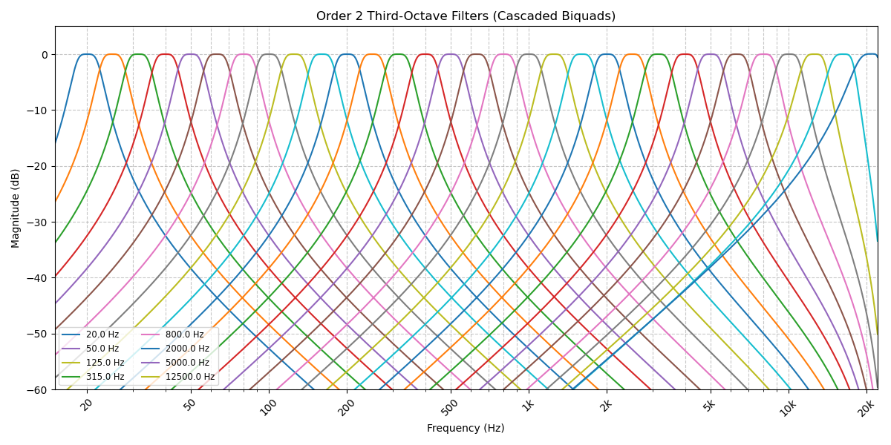

# Third-Octave Filter Bank Design with IIR Filters

This repository contains Python scripts for designing a **third-octave filter bank** using **Infinite Impulse Response (IIR)** filters implemented as **Second-Order Sections (SOS)**, along with a C++ example to demonstrate their real-world application. The filter bank splits the audible frequency range (20 Hz to 20 kHz) into 31 third-octave bands, ideal for audio analysis tasks like sound level meters, equalizers, or acoustic measurements.

The Python code generates filter coefficients for Butterworth bandpass filters (order 2 or 4) and visualizes the filter bank’s frequency response. The C++ code (`third_octave_filter.cpp`) shows how to implement these filters in a real-time audio processing context using **Direct Form I (DFI)**, though it is provided as a reference and is not executable on its own.

This project accompanies my [Medium post](https://medium.com/@maxiaortiz22/designing-and-implementing-a-third-octave-filter-bank-with-sos-filters-in-python-and-c-37cb35f7429d), where I dive into the design process, the choice of SOS filters, and the rationale behind using DFI over Direct Form II (DFII).


## Features

* **31 Third-Octave Bands:** Covers 20 Hz to 20 kHz with standard center frequencies.
* **SOS Filter Design:** Uses Butterworth bandpass filters (order 2 or 4) for numerical stability.
* **Python Automation:** Generates filter coefficients and plots the filter bank’s response.
* **C++ Reference Implementation:** Demonstrates real-time filter bank processing with DFI.
* **Modular Code:** Separates filter design, coefficient generation, and plotting for clarity.

## Repository Structure

```
├── code/
│   ├── main.py                 # Entry point to generate filters and plot the filter bank
│   ├── filter_design.py        # Functions for designing SOS filters
│   ├── coefficient_export.py   # Functions for exporting coefficients to C++ format
│   ├── plotting.py             # Functions for plotting the filter bank response
│   └── third_octave_filter.cpp # C++ reference implementation (non-runnable)
├── README.md                   # This file
└── requirements.txt            # Python dependencies
```

## Getting Started

### Prerequisites

* **Python 3.8+** with the following packages:

```bash
pip install -r requirements.txt
```

(Includes `numpy`, `scipy`, and `matplotlib`.)

* A C++ compiler (e.g., `g++`) if you wish to adapt the C++ code for your own use.

### Usage

* Clone the Repository:

```bash
git clone https://github.com/maxiaortiz22/third-octave-bank-iir-filter-design.git
cd third-octave-bank-iir-filter-design
```

* Install Dependencies
* Run the Main Script:

Execute `main.py` to:

* Design the third-octave filter bank.
* Generate filter coefficients (saved as `cpp_coefficient_initialization.txt`).
* Plot the frequency response of the filter bank.

```bash
python main.py
```

### Output:

* A plot window displaying the filter bank’s frequency response.
* A `cpp_coefficient_initialization.txt` file with C++-ready coefficient initialization code.


### Explore the C++ Implementation:

* The `third_octave_filter.cpp` file is a reference implementation showing how to use the generated coefficients in a real-time audio processing pipeline.
* It is **not executable** as-is, as it requires integration with an audio framework (e.g., JUCE, PortAudio). Use it as a template for your own projects


## Example Output
Running `main.py` produces a plot like this:



The generated `cpp_coefficient_initialization.txt` contains code like:

```cpp
void initializeCoefficients() {
    // Band 0: 20 Hz
    pFilterBank->bands[0].num_sections = 1;
    pFilterBank->bands[0].sections[0].b[0] = 9.1839749966e-08;
    // ... (more coefficients)
}
```

## How It Works

* Python Design:

    * `filter_design.py`: Computes band edges, designs Butterworth SOS filters for each third-octave band and Normalize every filter gain.
    * `export_to_cpp.py`: Exports SOS coefficients to C++ format.
    * `plot_filter.py`: Visualizes the frequency response of all 31 bands.
    * `main.py`: Orchestrates the design, export, and plotting processes.

* C++ Implementation:

    * Uses **Direct Form I (DFI)** for biquad processing, chosen for simplicity and stability in floating-point arithmetic.
    * Supports order 2 or 4 filters with cascaded biquads (1 or 2 sections per band).
    * Includes logic for processing audio samples and computing RMS levels for each band.


## Why SOS and Direct Form I?

* **Second-Order Sections (SOS):** Splitting high-order filters into biquads improves numerical stability, especially for high frequencies near the Nyquist limit (24 kHz at 48 kHz sample rate).
* **Direct Form I (DFI):** Chosen over Direct Form II (DFII) for its simplicity, ease of implementation in cascaded filters, and sufficient stability in floating-point. See my Medium post (#) for a detailed comparison of DFI vs. DFII.


## Limitations

* The C++ code is a reference and not a standalone executable. You’ll need to integrate it with an audio processing framework.
* The filter bank is designed for a 48 kHz sample rate. Other sample rates require redesigning the filters.


## License

This project is licensed under the MIT License. See LICENSE for details.


## Contact

Questions or ideas? Reach out via [LinkedIn](https://www.linkedin.com/in/maximiliano-ortiz-7664541a9/) or find me on [Medium](https://medium.com/@maxiaortiz22).


